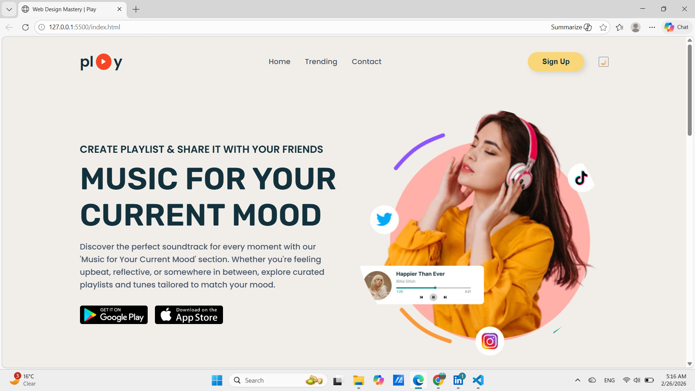
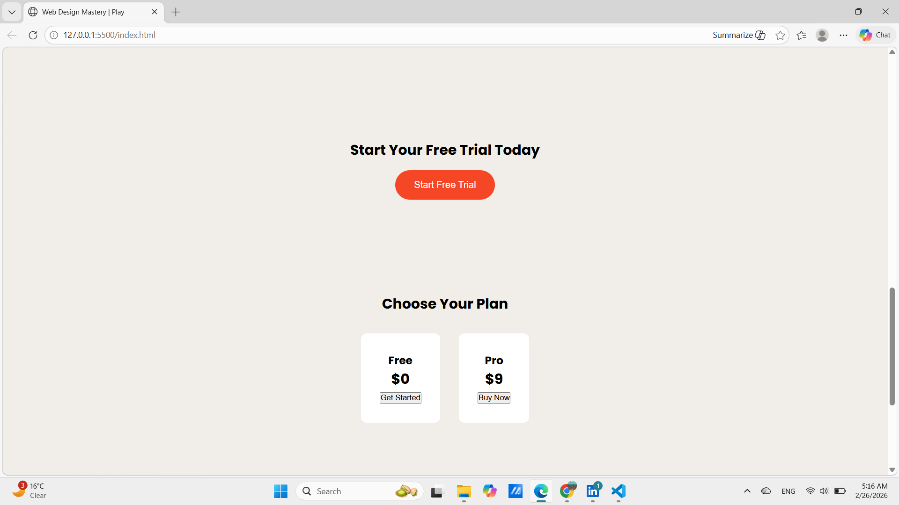
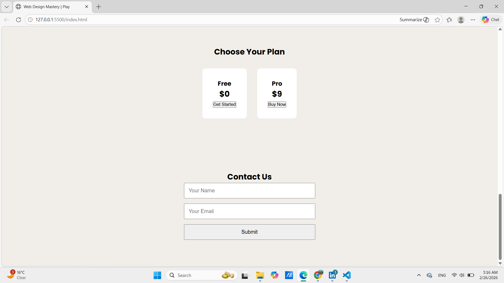
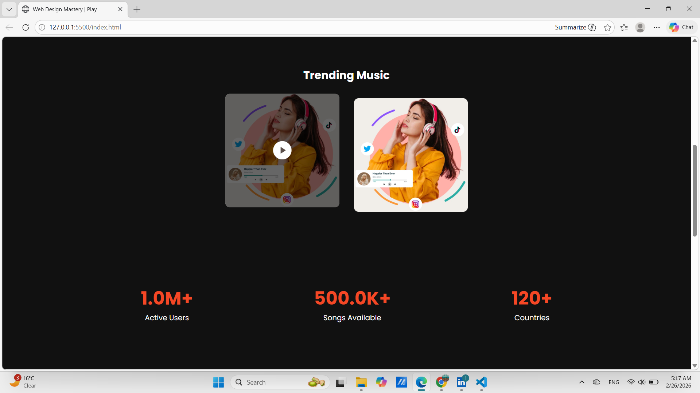

# 🎵 Interactive Music Landing Page

A modern, responsive, and fully interactive landing page designed for a music streaming service.  
This project demonstrates the use of animations, transitions, and JavaScript interactions to enhance user engagement and encourage action.

---

## 📌 Project Overview

This landing page is designed to simulate a real-world music streaming platform.  
It focuses on:

- Engaging UI/UX
- Smooth animations
- Interactive components
- Clear Call-To-Action elements

The goal of this project is to build a visually appealing and interactive front-end experience using core web technologies.

---

## ✨ Key Features

### 🎨 UI & Design
- Fully Responsive Layout
- Modern and Clean Interface
- Smooth Scroll Navigation
- Hover Effects & Micro-interactions

### 🎬 Animations & Effects
- ScrollReveal Animations
- Hover Transitions
- Animated Counters (Stats Section)
- Modal Pop-up Animation
- Navbar Scroll Effect

### ⚙️ JavaScript Interactions
- Mobile Navigation Toggle
- Dark Mode Toggle
- Animated Statistics Counter
- Contact Form Validation
- Modal Open/Close (with ESC & outside click support)

### 📢 Call-To-Action Elements
- Start Free Trial Button
- Pricing Plan Buttons
- Sign Up Button
- Contact Form Submission

---

## 🛠️ Tech Stack

- HTML5
- CSS3 (Flexbox, Grid, Transitions)
- JavaScript (ES6)
- ScrollReveal.js

---

## 📂 Project Structure

```
📁 Interactive-Music-Landing-Page
│── index.html
│── style.css
│── script.js
│── images/
```

---

## 🎯 Learning Objectives

This project demonstrates:

- DOM Manipulation
- Event Handling
- Scroll-based Animations
- UI State Management
- Responsive Web Design Principles
- Clean Code Structure

---

## 📸 Screenshots

### 🏠 Landing Page Home


### ✨ Features Section




### 🎬 Dark Mode


### 📱 Responsive View


---

## 🔮 Future Improvements

- Add LocalStorage support for Dark Mode persistence
- Improve email validation using Regex
- Add Testimonials Section
- Integrate real music API
- Add loading animation

---

## 👨‍💻 Author

**Sujal Piprikar**

- GitHub: (https://github.com/sujalpiprikar01)
- LinkedIn: (www.linkedin.com/in/sujal-piprikar-693548260)

---

## 📄 License

This project is created for internship purpose.
